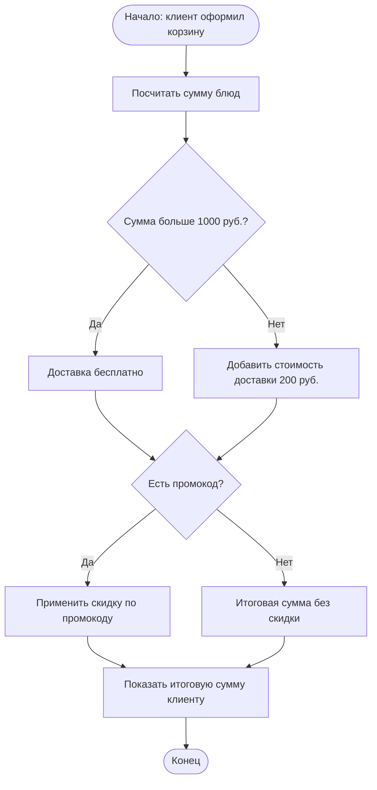

# Flowchart — Расчёт стоимости заказа с доставкой

Блок-схема алгоритма расчёта итоговой стоимости заказа еды
с учётом бесплатной доставки и промокода.

```mermaid
flowchart TD
    A([Начало: клиент оформил корзину]) --> B[Посчитать сумму блюд]
    B --> C{Сумма больше 1000 руб.?}
    C -- Да --> D[Доставка бесплатно]
    C -- Нет --> E[Добавить стоимость доставки 200 руб.]
    D --> F{Есть промокод?}
    E --> F
    F -- Да --> G[Применить скидку по промокоду]
    F -- Нет --> H[Итоговая сумма без скидки]
    G --> I[Показать итоговую сумму клиенту]
    H --> I
    I --> J([Конец])
```