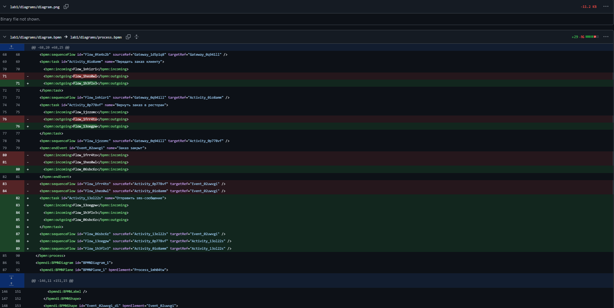
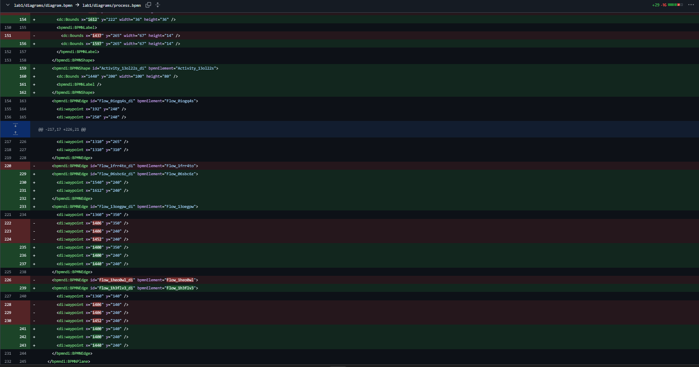
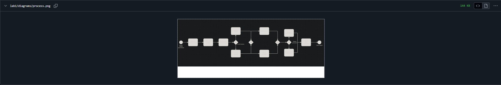
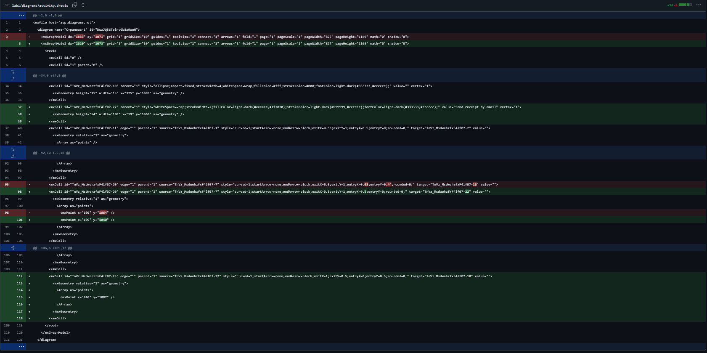
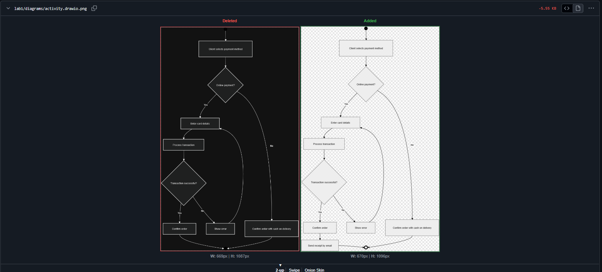
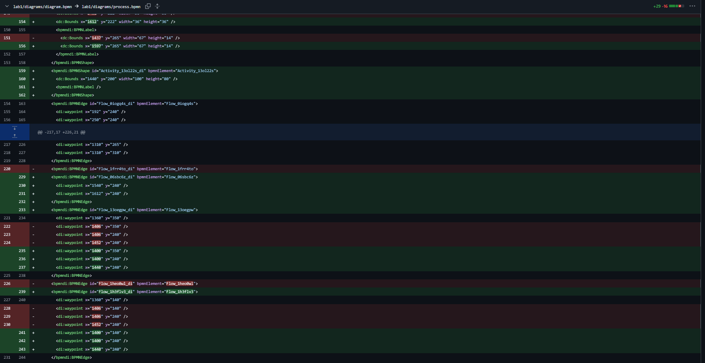
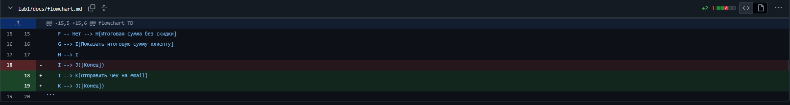

# Лабораторная работа №1. Моделирование процессов с использованием Git и визуальных нотаций

## 1. Краткое описание процесса

**Тема:** Заказ еды в ресторане с доставкой.

**Участники:** клиент, приложение/оператор, платёжный сервис, кухня, курьер, SMS-сервис.

Клиент выбирает блюда, указывает адрес и подтверждает заказ, после чего
оплачивает онлайн или при получении. Параллельно кухня готовит заказ, а курьер
выезжает к ресторану. После доставки клиент подтверждает получение — ему
приходит чек на email и SMS-подтверждение.

Полное описание — в `docs/process_description.md`.

## 2. Диаграммы

### 2.1. BPMN

Исходник: `diagrams/process.bpmn`

### 2.2. UML Activity

Исходник: `diagrams/activity.drawio`

### 2.3. Sequence (Mermaid)
Исходник: `docs/sequence.md`

### 2.4. Flowchart (Mermaid)
Исходник: `docs/flowchart.md`

## 3. Diff текстовых и бинарных форматов

> Diff некоторых файлов не помещался на один экран, поэтому я делал
> по 2–3 скриншота на файл. Они идут по порядку, сверху вниз.

### 3.1. BPMN (текстовый XML)

В `process.bpmn` добавлена новая задача `Activity_130l22s` с именем
«Отправить sms-сообщение», а также перестроены потоки: удалены
`Flow_1heo0m1` и `Flow_1frr4t0`, добавлены `Flow_1h3flv3` и `Flow_13oegpw`.

Виден **построчный diff** — конкретные строки XML.

### 3.2. UML Activity (текстовый XML) vs PNG (бинарник)

В `activity.drawio` добавлен новый узел `Send receipt by email`
(id `TnVz_MsdwehzfxF4lf07-22`) и новое ребро `TnVz_MsdwehzfxF4lf07-23`,
которое ведёт от «Send receipt by email» к конечному узлу. Также изменён
target у ребра `-20` — теперь «Confirm order» идёт не сразу к End,
а к новому узлу.

`.drawio` — это XML, diff читается построчно.

Для бинарного PNG GitHub показал **визуальное превью «Deleted / Added»**:
видно, что в новой версии появился блок «Send receipt by email».
Но **построчного diff** для PNG нет — это бинарный формат.

### 3.3. Mermaid-файлы (чистый текст)

В `sequence.md` добавлен новый участник `participant S as SMS-сервис`
и два новых сообщения: `A->>S: Отправить SMS-подтверждение` и
`S-->>C: SMS с номером заказа`.

В `flowchart.md` добавлен узел `K[Отправить чек на email]`:
одна строка `I --> J([Конец])` **удалена**, две новые
(`I --> K[...]` и `K --> J([Конец])`) **добавлены**.

Diff для Mermaid-файлов максимально наглядный — видно каждую
добавленную и удалённую строку.

## 4. Выводы

В ходе работы я настроил Git-репозиторий, освоил базовые команды и
научился работать с четырьмя нотациями: BPMN, UML Activity, Sequence
и Flowchart. Отдельно разобрался с тем, как Git отслеживает изменения
в разных форматах.

Самым интересным для меня было сравнение diff. Текстовые файлы
(`.bpmn`, `.drawio`, `.md` с Mermaid) версионируются удобно: Git видит
конкретные строки и показывает, что именно изменилось — добавилась
задача, поменялся поток, появился новый узел. А бинарные PNG — нет:
Git хранит только факт изменения, а не его содержимое, и в лучшем случае
показывает визуальное превью «до/после». Из-за этого становится понятно,
почему для диаграмм важно хранить исходники в текстовом виде, а PNG
использовать только как экспорт для отчётов и презентаций.

Ещё я понял, что осмысленные коммиты и продуманная структура папок
сильно упрощают работу: когда нужно вернуться к старой версии диаграммы
или объяснить, что менялось, — история коммитов и diff дают ответ
мгновенно.